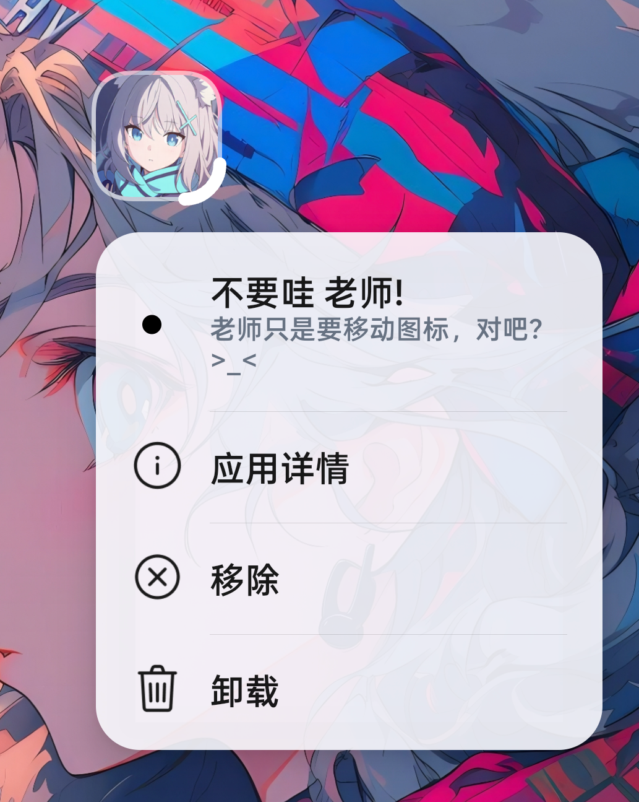
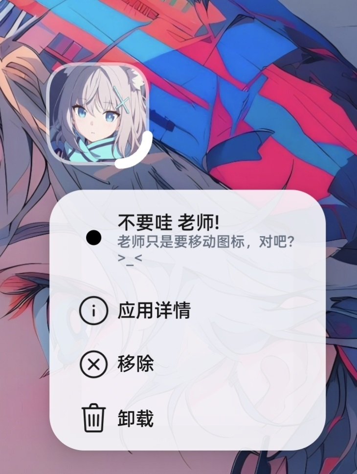

# LauSo

**ColorOS Launcher 长按菜单标语模块**

[下载模块](https://github.com/TheKingBucket001/Lauso/releases/latest) · [源代码](https://github.com/TheKingBucket001/Lauso) · [问题反馈](https://github.com/TheKingBucket001/Lauso/issues)

---

## 项目简介

LauSo 是为 ColorOS 系统桌面设计的 LSPosed 模块。它在应用图标长按菜单中加入可按应用配置的标语，并提供菜单外观与系统菜单项管理。

## 效果展示

LauSo 让应用专属文字自然融入系统桌面的长按菜单：既能保留完整的信息层次，也能呈现简洁利落的操作面板。

<table>
  <tr>
    <td align="center" width="50%"></td>
    <td align="center" width="50%"></td>
  </tr>
  <tr>
    <td align="center"><strong>完整呈现</strong> 主标语、副标语与系统操作分区清晰显示。</td>
    <td align="center"><strong>简洁呈现</strong> 在更轻巧的版面中保留核心信息与操作。</td>
  </tr>
</table>

## 支持范围

| 项目 | 说明 |
| --- | --- |
| 已验证系统 | ColorOS 16 / Android 16 |
| 已验证系统桌面 | `com.android.launcher` 16.6.17 |
| 框架要求 | LSPosed API 101 或更高版本，设备已获得 Root 权限 |
| 模块作用域 | 系统桌面：`com.android.launcher` |

不同 ColorOS 版本或系统桌面版本的菜单结构可能变化。未列出的系统版本请先自行验证，并在反馈时附上系统桌面版本。

## 安装与启用

1. 从 [Release](https://github.com/TheKingBucket001/Lauso/releases/latest) 下载并安装 LauSo。
2. 在 LSPosed 中启用模块，作用域选择“系统桌面” `com.android.launcher`。
3. 重启设备后打开 LauSo，完成 Root 授权检查。
4. 点击添加，填写应用包名和主标语；副标语与点击气泡均为可选项。
5. 返回桌面，长按对应应用图标并重新打开菜单即可查看效果。

## 功能

- 按应用设置主标语、副标语和点击气泡。
- 点击标语后收起菜单；未填写点击气泡时不显示提示。
- 提供半透明白菜单、紧凑菜单、视觉舒适和关闭全屏背景模糊选项。
- 视觉舒适仅在紧凑菜单开启时可用，只调整标语下方空白。
- 可移除“更多”入口、隐藏应用快捷方式，或按需隐藏隐私锁、应用详情、分享、编辑和服务卡片等系统菜单项。

## 使用提示

- 保存规则或外观设置后，需要重新打开应用长按菜单才能看到变化。
- 删除规则后，对应应用会恢复原有的长按菜单。
- 模块未在 LSPosed 中加载或 Root 授权未通过时，应用会提示先完成环境检查。

## 问题反馈

请在 [Issues](https://github.com/TheKingBucket001/Lauso/issues) 提交问题，并附上以下信息：

- LauSo 版本、Android 版本、ColorOS 版本与系统桌面版本。
- LSPosed 版本，以及是否已启用 `com.android.launcher` 作用域。
- 可复现步骤、相关设置与截图或日志。

## 许可证

本项目采用 [GNU General Public License v3.0](https://github.com/TheKingBucket001/Lauso/blob/main/LICENSE)。
